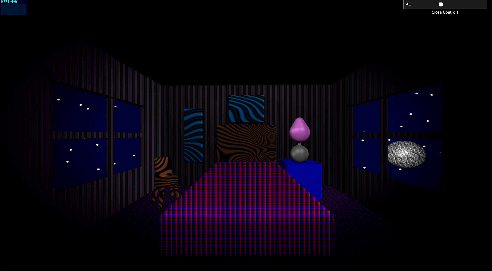
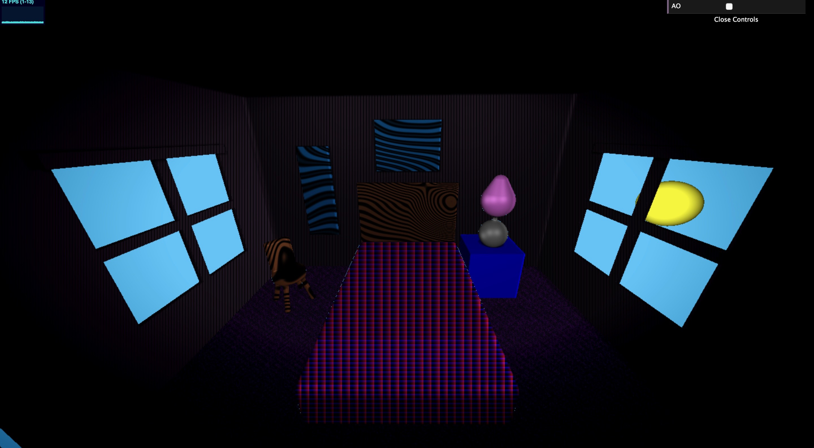
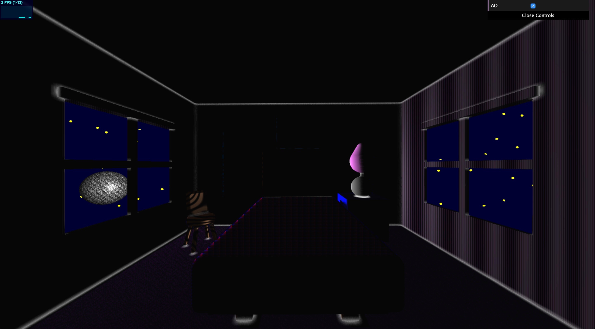
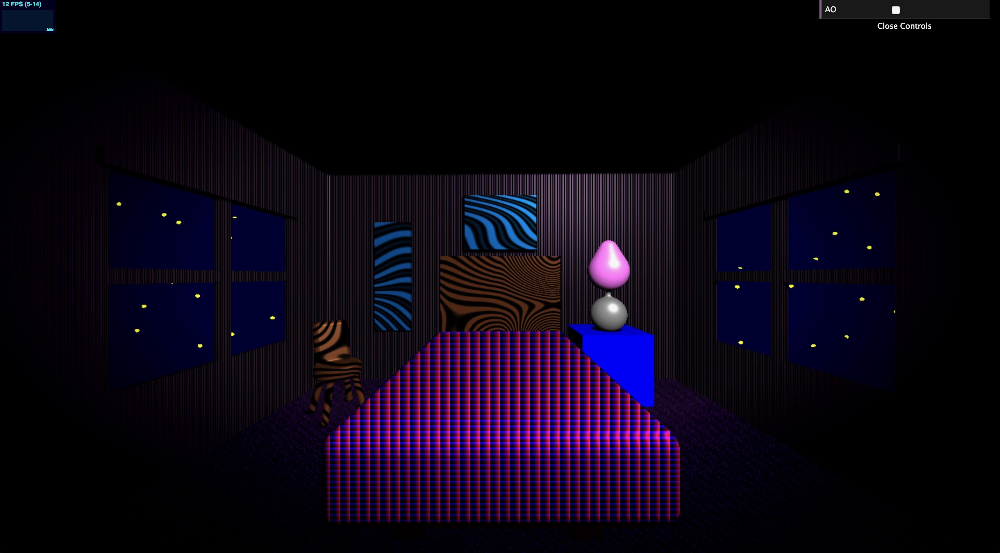
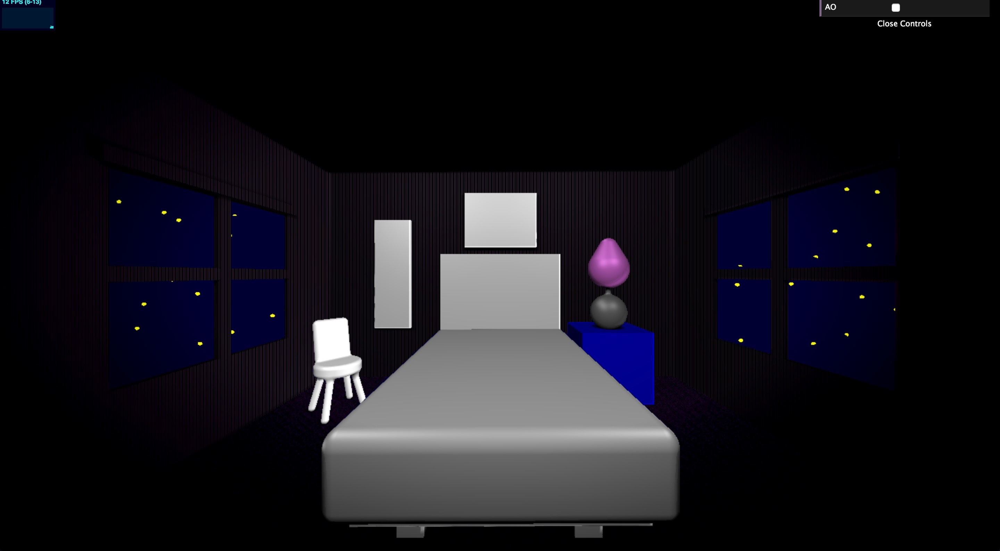
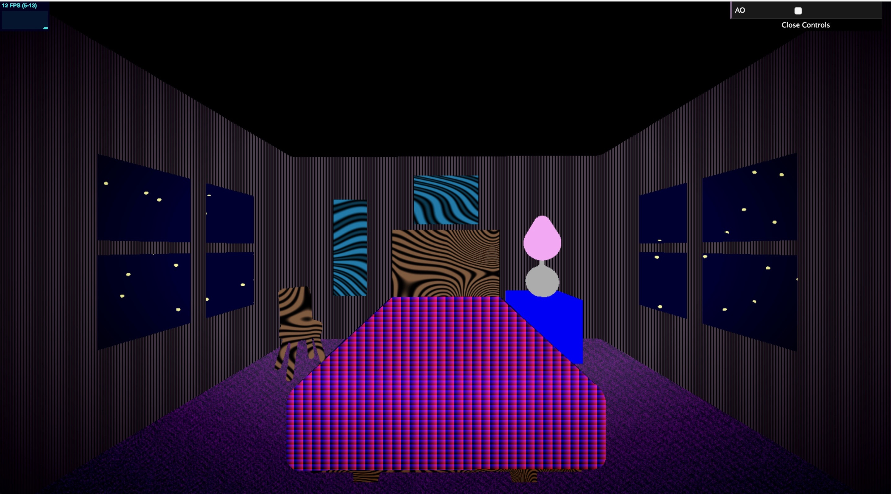

# CIS 566 Homework 3: Environment Setpiece

Name: Gizem Dal

Pennkey: gizemdal

Live demo: https://gizemdal.github.io/hw03-environment-setpiece/

Resources:
I've mainly used the techniques discussed in the CIS566 lecture slides & Piazza, but there are a couple other outside resources I've used to implement some features and also get some inspiration. These resources include:

- Inigo Quilez's website for SDF primitives and other noise functions: https://www.iquilezles.org/www/articles/distfunctions/distfunctions.htm
- The Book of Shaders (for implementing textures & noise): https://thebookofshaders.com/11/
- Jamie Wong (for transform functions): http://jamie-wong.com/2016/07/15/ray-marching-signed-distance-functions/
- ShaderToy

Project Aim:

For this project, I aimed to visualize a simple bedroom scene with a chair, a twin-size bed, a nightstand with a lamp and pictures on the wall. I wanted to have a setting where I could experiment with noise functions to create material textures and set them to several furnitures created by SDFs, so creating a bedroom setting felt like it would definitely serve the purpose. Another way I got inspired by a bedroom setting is a 3D-Modeling Environment Project I had for a class last year, where I built a replica of my college bedroom, focusing on small details of several furniture to make them accurate and life-like.

Features & Techniques:

Animation of the Environment Elements: I imitated a day cycle by having a spherical SDF primitive that would perform a circular motion around the bedroom, where the sphere would have a "moon" texture and color during nighttime and a "sun" color during daytime. Another animation I included, although it is very subtle, is the color of the stars of the night sky, where their colors shift between yellow and white as a function of elapsed time.

Use of Noise Functions: I incorporated the use of several noise functions mainly for texturing purposes for this environment setting. These include Fractal Brownian Motion (for the purple carpet and the moon texture), Worley noise (for the night sky) and other alterations of the general noise functions that would take in a value pair and map them to seemingly random values. Noise-generated textures include the wood texture of the bed frame and the chair, the two pictures on the wall, the carpet and the moon.

Toolbox functions: I used several toolbox functions such as Square Wave, Sin and Cosine to generate textures as well as object movements. For instance, I made use of the Square Wave function to get the striped texture of the wallpaper, while I used Sin and Cosine in noise functions as well as for the circular motion of the moon/sun.

SDF Based Soft Shadows: I implemented the Penumbra Shadows, discussed by Inigo Quilez at https://iquilezles.org/www/articles/rmshadows/rmshadows.htm to make my light sources create shadows in the scene. In order to have not completely black shadows, I incorporated the color of the objects in the shadow as well.

Environmental Lighting from Light Sources: I have three light sources in the scene: one is the moon/sun and the other two are static key and fill lights. Incorporating a dynamic light source helped me get more interesting shadows (since they would shift orientation as the moon revolves around). However, having two other static light sources helped me maintain a well-lit room such that the illumination wouldn't be only dependent on the moon.

Vignette: I believe that vignettes have a very dramatic and sensational impact on scenes, so I said "Why not?" and included one in my scene. The vignette has an effect on the fragments that are far from the center of the screen by a certain hard-coded amount. (Note: The vignette effect is diabled if the ambient occlusion effect is enabled.)

SDF Blending: Using SDF blending functions such as union and subtraction helped me create way more interestingly shaped and sophisticated objects in my scene. For instance, the wooden chair is made of the smooth union of a rounded rectangular box, rounded cylinder and multiple vertical capsules. The subtraction function helped me build windows on the walls by subtracting
my window area from the wall.

Raymarched Scene: As described in the previous sections, raymarching was the main and most vital technique in the creation of this scene, from creating all the furniture to implementing soft shadows.

Progress Images:

I captures a couple screenshots of my environment scene as I implemented my features. This should give you a better idea of how the scene looks under different circumstances (such as the differences between night time and day time, AO effect enabled/disabled).

The Bedroom (With darker lights):

Morning:

Moon as the Only Light Source:

Static Lights as the Only Light Source:

No Texture:

Without Any Shadows, Lambertian and Specular Effects:

